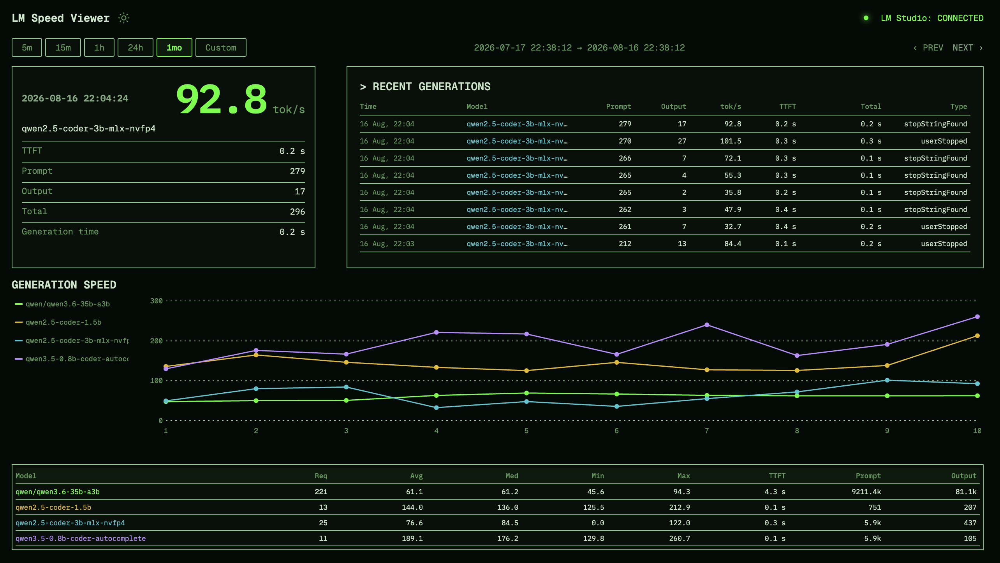

# LM Speed Viewer v0.9

> **See how fast your local LLM is running—at the moment it matters.**
>
> LM Speed Viewer turns LM Studio generation logs into a focused live dashboard:
> speed first, context close behind, and history when you want to compare.

**⚡ Live tok/s** &nbsp; **📈 Built-in history** &nbsp; **🔒 Passive and local**



## Make every generation easier to read

LM Speed Viewer is a tiny local web app for the **latest completed** LM Studio
generation. It puts generation speed (tok/s) front and centre, adds the
latency and token details that explain it, and keeps a historical graph of past
generations.

It is a passive observer: it runs the `lms` CLI log stream as a child process
and displays what LM Studio logs. It does not proxy, restart, or configure
LM Studio in any way.

## Highlights

- ⚡ **Speed, first.** See the latest completed generation's tok/s without
  digging through logs.
- ⏱ **Context at a glance.** Check the model, time to first token (TTFT),
  prompt/output/total token counts, and generation time together.
- 📈 **History that stays useful.** Explore 5m, 15m, 1h, and 24h views, or the
  past month's last ten values per model—stored locally in SQLite.
- 🧭 **Compare models clearly.** Filter the graph from its clickable legend and
  compare values on hover.
- 🗂 **Recent runs, ready when needed.** Review the eight newest generations,
  independent of the graph's selected range.
- 🟢 **Know the collector state.** The dashboard labels Connected,
  Disconnected, Error, or Waiting for first prediction.

## Requirements

- Python 3.10+
- LM Studio installed and running, with the `lms` CLI on your PATH
  (or at `~/.lmstudio/bin/lms`)

## Install

For a standalone command available from any directory, install with
[pipx](https://pipx.pypa.io/):

```sh
pipx install .
```

`pipx` creates and manages an isolated virtual environment for the command; do
not commit a project `.venv`.

For development, create a local environment if desired and install the project
in editable mode:

```sh
python -m venv .venv
source .venv/bin/activate
pip install -e . -r requirements-dev.txt
```

### npm

The same CLI is also published as
[`lm-speed-viewer`](https://www.npmjs.com/package/lm-speed-viewer):

```sh
npm install --global lm-speed-viewer
lm-speed-viewer
```

The npm launcher requires Python 3.10+ and creates an isolated environment at
`~/.lm-speed-viewer/venvs/<version>` the first time it runs. Set
`LM_SPEED_VIEWER_VENV` to store that environment elsewhere.

## Run

```sh
lm-speed-viewer
```

Optional configuration:

```sh
lm-speed-viewer --host 127.0.0.1 --port 8765 --db /tmp/speed-history.db
```

The compatibility launcher remains available:

```sh
python app.py
```

Then open: **http://127.0.0.1:8765**


After a versioned change is merged into `main`, the `Publish npm package`
workflow runs the package, lint, and Python tests, then publishes only if the
new version is not already on npm. Merges with no version increase skip
publishing.

Before the first automated release, configure npm trusted publishing for
`lm-speed-viewer` with GitHub Actions: owner `AlexeyPlatkovsky`, repository
`lmstats`, workflow `publish-npm.yml`, and allow `npm publish`. npm requires an
initial package publication before trusted publishing can be configured; publish
the first version manually with a short-lived npm token, then add the trusted
publisher. No npm token is stored in this repository.

## History persistence

The viewer stores all completed predictions in a local SQLite database
located at `~/.lmstudio-speed-viewer/history.db` by default. The graph UI
reads from this database via the dashboard and history endpoints.

### Override location

Set the `LM_SPEED_VIEWER_DB` environment variable to use a different path:

```sh
LM_SPEED_VIEWER_DB=/tmp/speed-history.db python app.py
```

### Limitations

- Only the **latest** generation is shown in the hero view.
- Internal/housekeeping LM Studio requests (e.g. title generation) are not
  classified and may temporarily become the latest prediction.
- The history graph stores predictions locally; clearing the SQLite file
  removes all historical data.
- Predictions reporting more than 999 tok/s are ignored as implausible log outliers.
- More than six models use calculated shades of the six base graph colors.

## FAQ

### Does it control LM Studio or send my prompts anywhere?

No. The viewer passively reads LM Studio's output log stream. It does not
proxy requests, restart LM Studio, or change its configuration.

### Where is the history stored?

Completed predictions are stored locally in SQLite at
`~/.lmstudio-speed-viewer/history.db` by default. Use `--db` or the
`LM_SPEED_VIEWER_DB` environment variable to choose another location.

### Why is the dashboard waiting for a prediction?

The viewer has not yet received a completed generation from the LM Studio log
stream. Run a generation, then refresh the dashboard if needed.

### Can I clear the history?

Yes. Stop the viewer and remove its SQLite database file, or point the viewer
at a new database with `--db` or `LM_SPEED_VIEWER_DB`.

### Why might a generation not appear on the graph?

The hero view shows only the latest completed generation. The graph stores
completed predictions, except implausible log outliers above 999 tok/s; some
internal LM Studio requests can also temporarily become the latest prediction.
